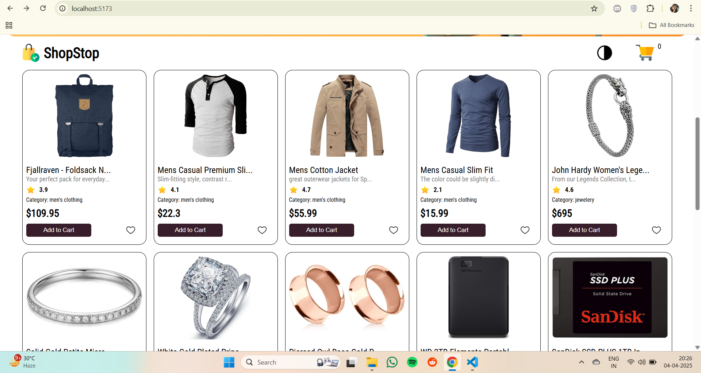

# ShopStop - Growthzi Assignment

A simple e-commerce assignment

## Preview

Here are some preview images of the project:





## Getting Started

Follow the steps below to clone, install dependencies, and run the project locally.

### Clone the Repository

```sh
git clone https://github.com/ShadmanKhan10/Growthzi-Assignment
cd server
npm install
npm start
cd client
npm run dev
```
